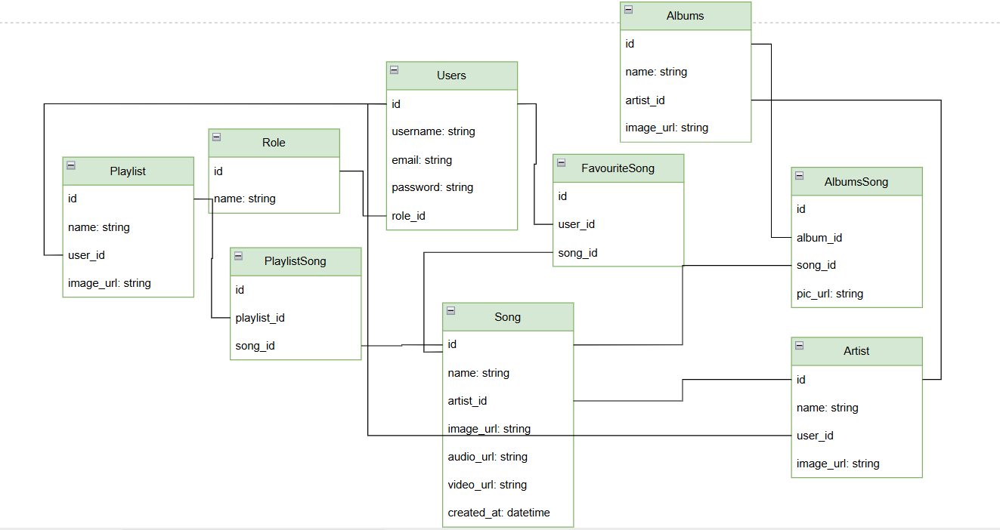

# Spotify API Clone 🎵

Đây là một dự án xây dựng RESTful API mô phỏng lại một phần chức năng của Spotify, bao gồm quản lý bài hát, nghệ sĩ, playlist, album, yêu thích,... Dự án sử dụng Django REST Framework, PostgreSQL, và tích hợp upload file lên AWS S3.

## 🚀 Các chức năng chính

- Đăng ký / Đăng nhập người dùng
- Quản lý bài hát (Song)
- Quản lý nghệ sĩ (Artist)
- Quản lý album và thêm bài hát vào album
- Tạo playlist và thêm bài hát vào playlist
- Yêu thích bài hát
- Upload ảnh / nhạc / video lên AWS S3
- Xác thực bằng JWT
- Chat Realtime với WebSocket

---

## 🧰 Công nghệ sử dụng

| Công nghệ                      | Mô tả                    |
|--------------------------------|--------------------------|
| Python 3.10                    | Ngôn ngữ lập trình chính |
| Django & Django REST Framework | Xây dựng API             |
| PostgreSQL                     | Cơ sở dữ liệu quan hệ    |
| AWS S3                         | Lưu trữ ảnh và nhạc      |
| JWT                            | Xác thực và phân quyền   |
| WebSocket                      | Chat Realtime            |

---

## 🗂️ Cấu trúc thư mục

```
spotify/
├── api/                  # Các view, serializer, models
├── chat/                 # Cấu hình WebSocket cho chức năng chat realtime
├── spotify/              # Cấu hình chính của project
├── requirements.txt      # Danh sách các package cần thiết
└── README.md
```

---

## ⚙️ Cài đặt & chạy ứng dụng

### 🔧 1. Clone dự án
```bash
git clone https://github.com/your-username/spotify-api.git
cd spotify-api
```

### 🐍 2. Tạo môi trường ảo và cài package
```bash
python -m venv env
source env/bin/activate    # hoặc .\env\Scripts\activate với Windows
pip install -r requirements.txt
```

### 🗄️ 3. Chạy migrations
```bash
python manage.py makemigrations
python manage.py migrate
```

### ☁️ 4. Cấu hình AWS S3
- Tạo tài khoản AWS và tạo bucket S3.
- Cấu hình thông tin AWS trong file `settings.py`:
```python
AWS_ACCESS_KEY_ID = 'your-access-key-id'
AWS_SECRET_ACCESS_KEY = 'your-secret-access-key'
AWS_STORAGE_BUCKET_NAME = 'your-bucket-name'
AWS_S3_CUSTOM_DOMAIN = f'{AWS_STORAGE_BUCKET_NAME}.s3.amazonaws.com'
AWS_S3_OBJECT_PARAMETERS = {
    'CacheControl': 'max-age=86400',
}
AWS_DEFAULT_ACL = None
```

### 🔑 5. Khởi động server
```bash
python manage.py runserver
```

> Truy cập API: http://localhost:8000/

---

## 🧪 Kiểm thử API

- Sử dụng Postman hoặc Swagger UI tại: `http://localhost:8000/swagger/` (nếu có cấu hình).
- Thực hiện các thao tác:
  - Đăng nhập: `POST /users/login/`
  - Thêm bài hát: `POST /songs/`
  - Tạo playlist: `POST /playlists/`

---

## 📸 Database Design

> 

---

## 👥 Thành viên thực hiện

| Họ tên           | Vai trò |
|------------------|---------|
| Tạ Đức Phú       | Backend & JWT Auth |
| Nguyễn Đức Trí   | AWS S3 & Media Upload |
| Huỳnh Nhựt Dương | API Playlist & Album |

---

## 📚 Tài liệu tham khảo

- [Django REST Framework](https://www.django-rest-framework.org/)
- [JWT.io](https://jwt.io/)
- [AWS S3 Docs](https://docs.aws.amazon.com/s3/)
- [PostgreSQL Docs](https://www.postgresql.org/docs/)

---

## 📌 Ghi chú

> Đây là đồ án mô phỏng API Spotify đơn giản cho mục đích học tập.


## License
This project is licensed under the MIT License - see the [LICENSE](./LICENSE) file for details.
